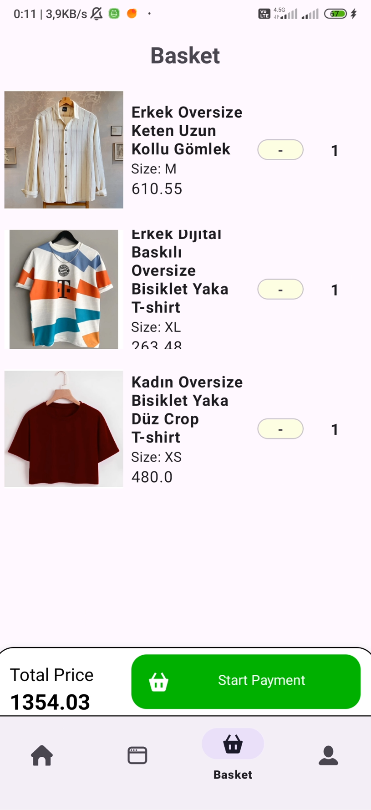

# E-Commerce Android Application

In this application, an e-commerce Android application has been developed using Kotlin.

## Technologies Used
- MVVM
- Room
- Firebase
- Dependency Injection
- Navigation
- Coroutines
- Multi-module (Payment Module)
- Single Activity Multi-Fragment Architecture

### basket page

### market page 

### detail page

### Card page

### Register page

